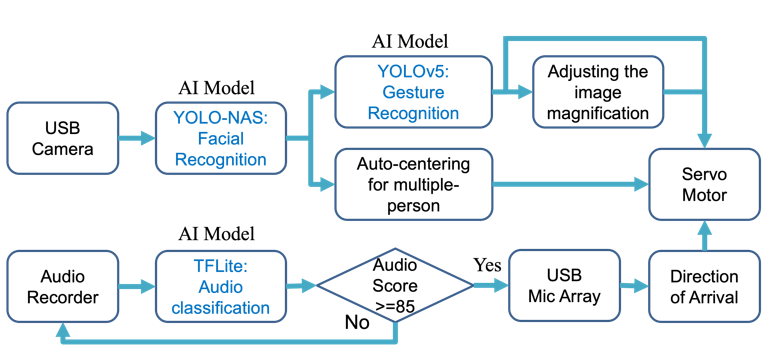

# Qualcomm QCS6490 Edge AI Label Defects Detection

## Advantages of QCS6490

1. QCS6490 can provide up to 12 TOPS of AI computing power and supports GPU and DSP accelerated computing
2. The Qualcomm Neural Processing (SNPE) SDK and the Qualcomm AI Engine Direct (QNN) can optimize the performance of trained neural networks
3. It supports Yocto, Ubuntu, Android, and Windows for AI development

## Performance Metrics

- **Facial Recognition**: Yolo-NAS
- **Gesture Recognition**: YOLOv5
- **Audio Classification**: TFLite

## Hardware

- **Platform**: [Qualcomm QCS6490](https://www.qualcomm.com/internet-of-things/products/q6-series/qcs6490)
- **Camera**: USB Camera

## Software & Toolkit

- **AI SDK (SNPE):** v2.12
- **System:** Android

## Background & Solution

### Motivation

Traditional conference systems lack awareness of the speaker’s position, causing remote participants to miss key visual context and feel less engaged. Most still rely on manual camera switching, which reduces efficiency and disrupts meeting flow

### Solution

Our Edge AI system performs real-time acoustic and visual inference. Using DOA (Direction of Arrival) sound source localization, it automatically directs a PTZ (Pan-Tilt-Zoom) camera to the active speaker. Gesture recognition enables automated camera control, delivering more natural and intelligent collaboration experience

## Architecture Diagram

## Demo

https://github.com/user-attachments/assets/01da94ea-e738-4958-aa7f-62bbc8e04c82

